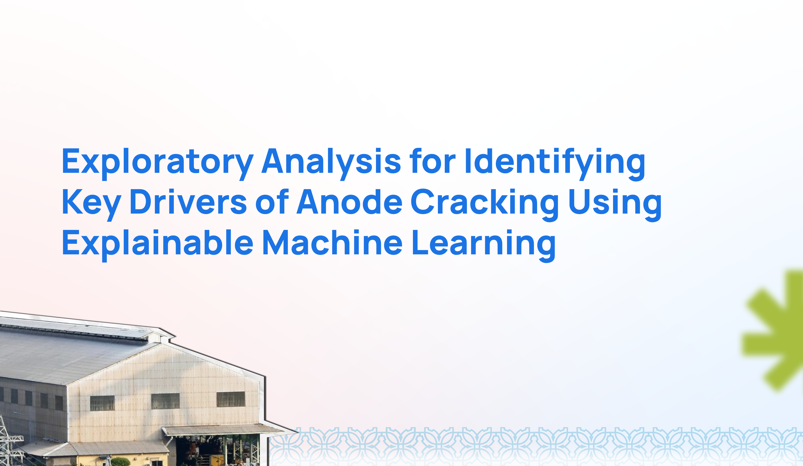
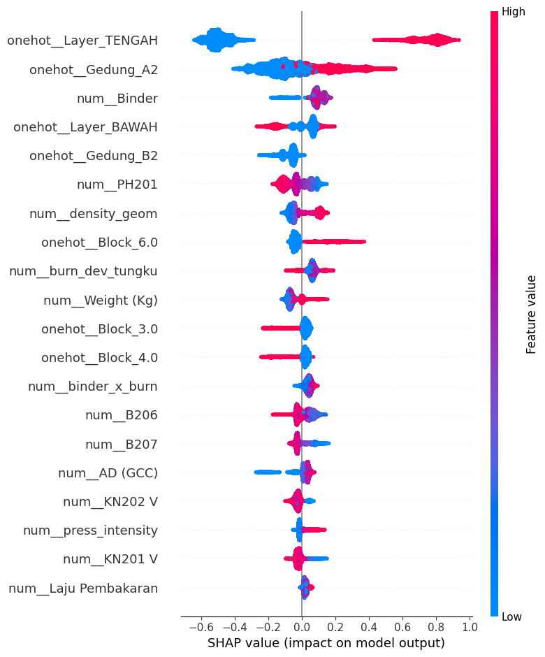
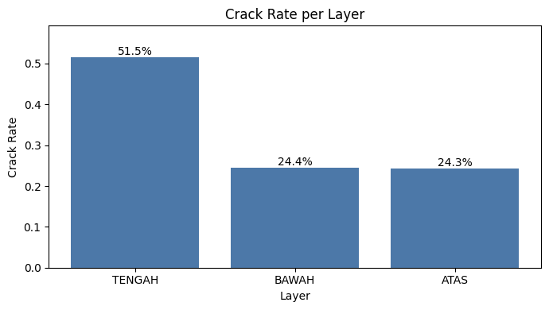
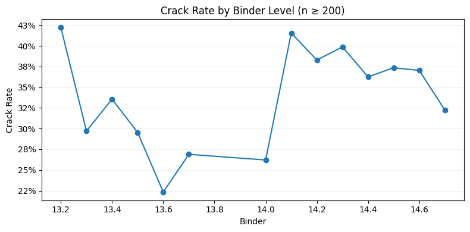
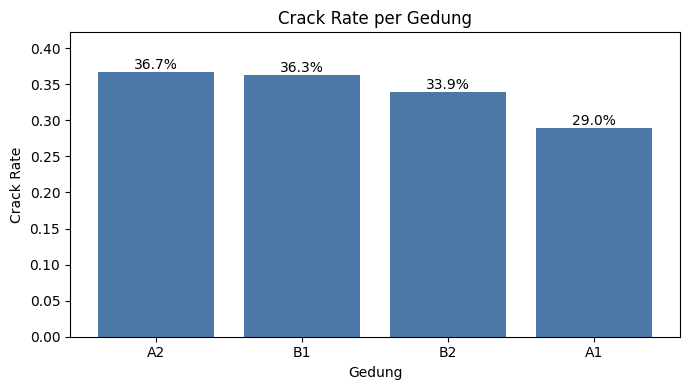

# 🔬 Anode Crack Prediction  
**Explainable Machine Learning for Identifying Key Drivers of Anode Cracking**

## 📖 Overview  
This project applies **Explainable Machine Learning (XAI)** and **Exploratory Data Analysis (EDA)** to identify process factors that are most strongly associated with **anode cracking** in aluminium production.

Rather than building a final operational prediction system, machine learning is used as an **exploratory screening tool** to:
- Filter key drivers from complex process data  
- Guide hypothesis-driven process investigation  
- Support data-informed technical decision making  

---

## 💼 Business Problem & Goals  
Anode cracking increases:
- Scrap and rework  
- Production time  
- Operational risk  

However, production involves many interacting parameters, making it difficult to identify dominant factors using manual observation alone.

**Main challenges:**
- Too many interacting process variables  
- Experience-based and subjective analysis  
- Reactive approach (after cracks occur)  

**Project goals:**
- Use ML as a screening tool for key drivers  
- Direct EDA toward the most relevant variables  
- Generate initial hypotheses for deeper investigation  

---

## 🛠️ Tech Stack  
* **Programming:** Python  
* **Data Processing:** Pandas, NumPy  
* **Visualization:** Matplotlib, Seaborn  
* **Machine Learning:** CatBoost, LightGBM, XGBoost, Random Forest  
* **Explainability:** SHAP  

---

## 📂 Project Documentation  
Technical documentation is available in the `docs/` folder:

1. **[Anode Crack Report](docs/anode_crack_eda_report.pdf)** – Anode Crack EDA With XAI Report   

---

## 📈 Key Insights & Metrics  
Key findings include:

* The **middle layer** has the highest crack rate (~51%)  
* **Building A2** consistently shows higher crack risk  
* **Binder level** has a non-linear effect:
  - Moderate range → minimum risk  
  - Too low or too high → increased risk  
* Cracking is driven more by **process conditions** than by production volume  

**Best exploratory model (CatBoost):**
* ROC-AUC ≈ 0.73  
* PR-AUC ≈ 0.59  

---

## 🧩 Key Drivers (from SHAP)  
Most influential drivers:
- Layer position (middle layer highest risk)  
- Building location (A2 highest risk)  
- Binder level  
- Baking and handling parameters  

---

## 📷 Gallery

<table>
  <tr>
    <th align="center">SHAP Feature Importance</th>
    <th align="center">Crack Rate by Layer</th>
  </tr>
  <tr>
    <td align="center">
      
    </td>
    <td align="center">
      
    </td>
  </tr>
  <tr>
    <th align="center">Binder Effect</th>
    <th align="center">Building Comparison</th>
  </tr>
  <tr>
    <td align="center">
      
    </td>
    <td align="center">
      
    </td>
  </tr>
</table>

---

## 👤 Author  
**Imtiyaz Shaffal Afif**  
* Data Analyst | Machine Learning | Process Analytics  
* [LinkedIn](https://linkedin.com/in/imtiyazsa) | [Email](mailto:imtiyazshafhal.a@gmail.com)  

---

*Disclaimer: The dataset is not included due to confidentiality. The notebook structure and methodology remain reproducible using similar data.*
